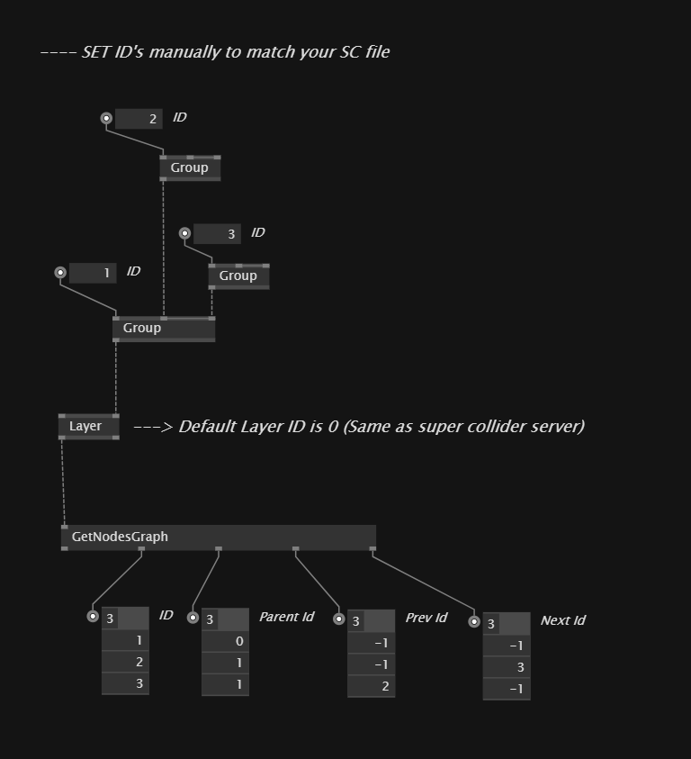

# VL.SCSynth
SuperCollider Server-Client Lib - foundation for vvvv and SC integration

## What is this?

VL.SCSynth (SuperCollider Server)[^5] is a minimal implementation of a standalone server executor (scsynth)[^10] using the [VL.IO.OSC](https://github.com/vvvv/VL.IO.OSC) lib. 

<cite>Read more about SuperCollider [here](https://supercollider.github.io/)</cite>

It supports all major OSC messages for manipulating the server itself and its nodes, such as SynthDefs, Synths, Groups and Busses (check [this list](#scserver-options) below).

Therefore it is bundled with all the appropriate functionalities to build your own messages and queries.

SCServer comes with an integrated SCClient (for receiving scynth responses). However SCClient can be used to access an active SuperCollider server by any machine, locally or internally. 

## Some useful notes

SuperCollider Server replies on the same port it listens to, since TCP is not supported yet in this version, you can get the OSC responses (via UDP) by exposing the hidden "Data" output pin on the OSCClient.

<cite>This functionality is already managed internally in order to get the status of the server, it's versions, and other useful information.</cite>

Both SCServer and SCClient are inheriting their methods from ISCSynth. This name was picked in order to signify that both are implementing and sharing methods to communicate directly with any active scsynth.

In example, once you started scsynth (either via SCServer or directly or by using the SC IDE), you can access it by introducing a SCClient on the VL side, respecting the IP Address and the binded port.

## SCSynth Node Factory

<ol>
<li>Create a folder named "synthdefs" next to your project file (root)</li>
<li>Populate the "synthdefs" folder with scsyndef files (compiled synthdefs)</li>
<li>Add VL.SCSynth to your patch project</li>
<li>Call SYNTHDEFS category from your nodebrowser</li>
<li>Pick and introdduce a Synth (instance) based on the provided synthdef files</li>
</ol>

## SCServer Options

So far only few options are being supported (the plan is to add all the available options). The idea was to keep it simple and minimal by adding only essential things.

- So you can choose if Server will use either the UDP <s>or the TCP</s> Protocol.

- Define Verbosity level.

- Bind a certain IP address.

- Bind a port for vice-versa communication.

<i>for more info regarding the scsynth arguments see:</i>

[scsynth_main.cpp on github](https://github.com/supercollider/supercollider/blob/develop/server/scsynth/scsynth_main.cpp)

## Server Commands & Messages (WIP)
Implemented according to [Server Command Reference](https://doc.sccode.org/Reference/Server-Command-Reference.html)

### Basic
|Node Name (in gamma)|OSC Address|Notes|
|---------|-----------|-----|
|ServerStatus|/status|(internal) Returns an object of type: ServerStatus|
|ServerVersion|/version|(internal) Returns an object of type: ServerVersion|
|DumpOSC|/dumpOSC|Console Log|
|Notify|/notify|Console Log|
|Error|/error|Console Log|

### SynthDefs
|Node Name (in gamma)|OSC Address|Notes|
|---------|-----------|-----|
|ReceiveSynthDef|/d_recv|Returns /done message|
|LoadSynthDef|/d_load|Returns /done message|
|LoadSynthDefDirectory|/d_loadDir|Returns /done message|
|DeleteSynthDef|/d_free|-|

### Nodes (Synth, Group, Bus)
|Node Name (in gamma)|OSC Address|Notes|
|---------|-----------|-----|
|DeleteNode|/n_free|-|
|RunNode|/n_run|-|
|SetNodeValue<T, U>|/n_set|Using SynthParameter Object|

## SynthParameter

A <i>Record<U,T></i> type object holding two fields:

- Name or Index can be either type of String or Integer32
- Value can be an Integer32, Float32 or String

## Layer

A Layer is representing the 0 Group (the base with additional functionalites) which is usually assigned to the Server by default in superCollider. 

Therefore, all the synths and the groups you may create should have a unique ID and always greater than 0.

In example:

It is not mandatory to keep order of IDs, although a good practice would be to assign bigger values especially to groups.

(this is an idea on how to face automatic ID assignement)

Imagine a Group with ID: 1000 and all of each children to add 100.

Group A (1000) <- Group B (1100)

And a Synth adds 1

Group A (1000) <- Synth 1 (1001)

and so on... 

## Before You Go
SCServer is still in progress, so changes will be often and may cause breaking changes. 

One important thing (which still needs some polishing) is that you have to set the SuperCollider installation folder manually every time you introduce the SCServer node. 

[^5]: See [Client vs Server Documentation](https://doc.sccode.org/Guides/ClientVsServer.html)

[^10]: [scsynth](https://github.com/supercollider/supercollider/wiki/scsynth-development) – A real-time audio server
