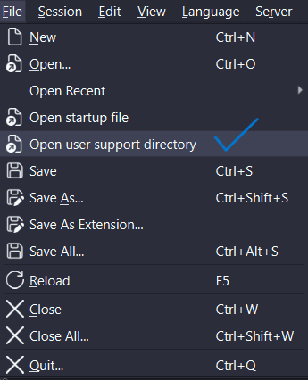
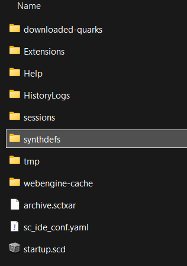

# VL.SCSynth
SuperCollider Server-Client Lib - foundation for vvvv and SC integration

## What is this?

VL.SCSynth (SuperCollider Server)[^5] is a minimal implementation of a standalone client and server executor (scsynth)[^10] using partially [VL.IO.OSC](https://github.com/vvvv/VL.IO.OSC) lib. 

<cite>Read more about SuperCollider [here](https://supercollider.github.io/)</cite>

It supports all major OSC messages for manipulating the server itself and its Nodes, such as SynthDefs, Synths, Groups and Busses (check [this list](#scserver-options) below).

Therefore it is bundled with all the appropriate functionalities to build your own messages and queries.

SCServer comes with an integrated SCClient (for receiving scynth responses). However SCClient can be used to access an active SuperCollider server by any machine, locally or internally. 

[^10]: [scsynth](https://github.com/supercollider/supercollider/wiki/scsynth-development) – A real-time audio server


## Development Status

⚠️ This project is currently in active development and may be subject to breaking changes, deprecations, and unstable features. Not recommended for production use.

## The Basics

#### Useful Notes

- SCSynth (the node) : It is a wrapper (higher level) of SCClient. SCSynth can additionally execute a SC Server (the actual scsynth.exe) in CLI mode (no IDE / no UI) on a predefined port.

- SCClient (the node) : This is the core communication handler and keeps the connection alive between vvvv and SC. It is responsible to Send and Receive all the commands via and from SC.

#### Important Notes

Every time you connect or disconnect a synth or a group from your node tree it forces SCRoot to freeAll and rebuild it from scratch. This means that in certain scenarios (i.e. SynthDefs which are using /doneActions) things may get weird.

Specifically, a Synth with a doneAction:0 , 2 (which forces it to be free after it is consumed) will break your vvvv node tree. If you want to prevent this, till we find a fix, better use doneAction:1 and use the t_trigger (triger controls) so the Synth is being paused and reused whenever is needful.

#### Preparations

In order to use VL.SCSynth in its full potential you will need to define / create a synthdefs folder next to your VL Patch (same as we do for Shaders or whenever a VL Factory is involved).

This is absolutely needful in order to get instances (synths) of your synth definitions as nodes in your vvvv patch.

### Use SynthDefs to Instanciate Synths

<b>Check the example in your Help Browser (F1) "Custom SynthDefs"</b>

<ol>
<li>Create a folder named "synthdefs" next to your project file (root)</li>
<li>Populate the "synthdefs" folder with scsyndef files (compiled synthdefs)</li>
<li>Call SYNTHDEFS category in your nodebrowser</li>
<li>Pick and introduce a Synth (instance) based on the provided synthdef files</li>
</ol>


## Using Super Collider (IDE)
### How to save a SynthDef File

In order to use a synthdef in vvvv context, first you have to compile and store it. Grace to the sclang.exe compilations is happenning under the hood, saving a file needs just a method to write/store your newly made synth definition on your disk.

Then you can browse it and introduce it through your node browser.


### WriteDefFile

There are two options atm, both are using the .writeDefFile method.  The most straight forward is to use the it without any arguments, this will compile and save (write on your disk) a .scsyndef file at your default synthdefs folder which can be found under the file menu (Open user support directory).

```sclang
(
    SynthDef(\ASynth, { |out=0, freq=440, amp=0.1,  t_gate=1|
        var sig = SinOsc.ar(freq) * EnvGen.kr(Env.perc,t_gate, doneAction: 0);
        Out.ar(out, sig * amp);
    }).writeDefFile(); 
)
```


**Find your SynthDefs in the default User Support Directory**


<p float="left">
 

<p>


### Save it directly 
The other way is to predefine a custom folder (probably your projects' synthdef folder) before you execute the method by passing a dir argument.
<code>
.writeDefFile("C:/yourproject/synthdefs", true);
</code>

**important** 
- the path is unix like (fwd slashes)
- prefer to add true on overwrite to avoid implications.


## Troubleshooting

### SCSynth fails with Error Code
<b>Server 'localhost' exited with exit code -1073741819</b> 

 Most probably there is something in the default synthdef folder which is preventing scsynth.exe to boot properly. Discard all the files (or the last added / suspcisious ones) and try to execute scsynth.exe again.

Another reason can be the port you are trying to reserve, keep in mind that the default port is `57110` and if the IDE (sclang) is up and running it will be bind on this one.

### Wrong Parameters Values
 If your synth's parameters looks messy then this happens because you are probably using a trigger control (t_argument), preferably declare "t_" arguments before any other argument, during the compilation SC prioritise triggers and brings them on top.

ie. Swap t_gate and bring it in front, do the same if you have more triggers on the same synthdef.

```sclang
|t_gate=1, out=0, amp=0.5, freq=200, rel=0.2, <s>t_gate=1</s>|
```

Set triggers first.

```sclang
|t_gate, t_trigger, t_something, out=0, amp=0.5, freq=200 ...| 
```

### Unable To bind UDP port

This may happen occasionaly, a good practice is first to start SC in case you wan to use its IDE along with VL.SCSynth.
However you may find yourself several times in this terrible position where Net realted errors will appear in the SC console during its startup or when booting the Server.
Most of the times, if anything else seems to work but a hard restart try first a Networking Restart, it my becomes handy to do these steps:


1. Run Cmd prmpt as Administrator 
2. `net stop winnat`
3. `net start winnat`

Usually this fixes the problem if not then try Reboot you computer, if the problem persists then you may have a look to [this thread](https://scsynth.org/t/win10-primitive-netaddr-sendmsg-failed-and-primitive-getlangport-failed/2085/4) in SC community forum.


# Sponsoring

The development of this library was mainly sponsored by:

 - [<b>3e8.studio</b>](https://www.3e8.studio) 
<!--  -->


